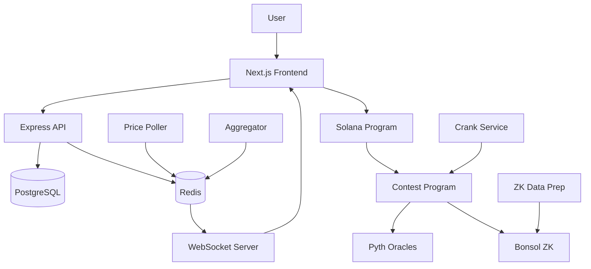

# Arbitron ⚡

> **The Fantasy Trading Arena on Solana**

Arbitron transforms crypto trading into a fun, fair, and skill-based competition. Join fast-paced 10-minute contests, strategically draft your virtual portfolio, and compete for prizes—all without liquidation risks.

[](https://solana.com)
[](https://bonsol.org)
[](./LICENSE)

## 🎯 What is Arbitron?

Crypto trading can feel intimidating, risky, and driven by emotion, leading many potential users to stay away. **Arbitron** solves this by:

- **🎮 Gamifying Trading**: Turn crypto speculation into a competitive, strategic game
- **🛡️ Eliminating Risk**: No liquidations, no real trades—pure skill-based competition  
- **⚡ Lightning Fast**: 10-minute rounds keep the action intense
- **🔒 Provably Fair**: Zero-knowledge proofs ensure transparent, tamper-proof results
- **🏆 Skill-Based Rewards**: Winners determined purely by strategy and market insight

## 🚀 How It Works

### 1. **Join a Contest**
- Browse active contests and pay the entry fee (e.g., 10 USDC)
- Each contest has a fixed duration (typically 10 minutes)

### 2. **Draft Your Portfolio**
- Select crypto tokens under budget and category constraints
- Choose one "Power Token" for 2x leverage
- Strategic token selection is key to winning

### 3. **Compete Live**
- Watch real-time market prices via Pyth oracles
- Track your P&L and ranking on the live leaderboard
- See how your portfolio performs against competitors

### 4. **Win Prizes**
- Highest P&L at contest end wins the prize pool
- Results verified via zero-knowledge proofs for fairness
- Prizes distributed automatically via Solana smart contracts
- Winners earn unique NFT badges as proof of skill

## 🏗️ Architecture

### Tech Stack

#### **Blockchain Layer**
- **Solana**: Fast, low-cost transactions for seamless gameplay
- **Anchor Framework**: Type-safe Solana program development
- **Bonsol ZK**: Zero-knowledge proof verification for fair outcomes
- **Pyth Network**: Real-time price feeds

#### **Backend Services**
- **PostgreSQL + Prisma**: Contest and user data management
- **Redis**: Real-time price updates and pub/sub messaging
- **WebSocket Server**: Live leaderboard updates
- **Aggregator Service**: P&L calculation engine
- **Crank Service**: Automated contest lifecycle management
- **ZK Data Prep**: Proof generation and verification

#### **Frontend**
- **Next.js 15**: React framework with App Router
- **TypeScript**: Type-safe development
- **TailwindCSS + shadcn/ui**: Modern, accessible UI components
- **Solana Web3.js 2.0**: Blockchain integration
- **TanStack Query**: Data fetching and caching

### System Flow



## 📦 Project Structure

```
arbitron/
├── programs/                    # Solana programs (Anchor)
│   └── arbitron/               # Main contest program
│       ├── src/
│       │   ├── handlers/       # Instruction handlers
│       │   ├── state/          # Account structures
│       │   └── lib.rs          # Program entry point
│       └── Cargo.toml
│
├── app/                         # Monorepo applications
│   ├── arbriton-frontend/      # Next.js web app
│   │   ├── app/                # Next.js app router
│   │   ├── components/         # React components
│   │   └── lib/                # Utilities
│   │
│   ├── api/                    # Express.js backend
│   ├── aggregator/             # P&L calculation service
│   ├── crank-service/          # Contest automation
│   ├── poller/                 # Price polling service
│   ├── ws-server/              # WebSocket server
│   ├── zk-data-prep/           # ZK proof preparation
│   └── zk-tx-submitter/        # ZK result submission
│
├── arbitron-pnl-guest/         # Risc0 ZK guest program
│   └── src/main.rs             # P&L calculation logic
│
├── packages/                    # Shared packages
│   ├── db/                     # Prisma database client
│   └── shared-redis/           # Redis utilities
│
├── dist/                       # Generated Solana client
│   └── js-client/              # TypeScript bindings
│
└── Bonsol-node/                # Bonsol ZK integration
```

## 🛠️ Setup & Installation

### Prerequisites

- **Node.js** 22+ and npm
- **Rust** 1.75+ with Solana toolchain
- **Anchor CLI** 0.31+
- **Docker** (for Redis & PostgreSQL)
- **Solana CLI** configured for devnet

### Quick Start

1. **Clone the repository**
   ```bash
   git clone https://github.com/yourusername/arbitron.git
   cd arbitron
   ```

2. **Install dependencies**
   ```bash
   npm install
   ```

3. **Set up environment variables**
   ```bash
   # Copy example env files
   cp .env.example .env
   cp app/arbriton-frontend/.env.example app/arbriton-frontend/.env.local
   
   # Edit with your configuration
   # - Database URLs
   # - Solana RPC endpoints
   # - Redis connection
   # - Pyth price feed addresses
   ```

4. **Start infrastructure services**
   ```bash
   docker-compose up -d
   ```

5. **Generate Prisma client**
   ```bash
   cd packages/db
   npx prisma generate
   npx prisma migrate dev
   ```

6. **Build Solana programs**
   ```bash
   anchor build
   npm run regenerate-client
   ```

7. **Deploy to Solana devnet**
   ```bash
   anchor deploy --provider.cluster devnet
   ```

8. **Start development servers**
   ```bash
   npm run dev
   ```

   This starts all services concurrently:
   - Frontend: http://localhost:3000
   - API: http://localhost:5000
   - WebSocket: http://localhost:8080
   - Aggregator, Poller, Crank services

## 🎮 Usage

### Creating a Contest

```bash
# Use the web UI or run the CLI
npm run create-contest --name "Lightning Round" --duration 600 --entry-fee 10
```

### Joining a Contest

1. Navigate to `/contests` on the web app
2. Connect your Solana wallet
3. Select tokens within budget constraints
4. Choose one Power Token for 2x leverage
5. Confirm transaction to join

### Monitoring Live Contests

- Real-time leaderboard updates via WebSocket
- Live P&L calculations based on Pyth price feeds
- Track your ranking as the contest progresses

## 🧪 Testing

```bash
# Run Anchor tests
anchor test

# Run TypeScript tests
npm test

# Run specific service tests
npm --workspace=@arbitron/api test
```

## 🔐 Security

- **Smart Contract Audits**: Pending (pre-mainnet)
- **Zero-Knowledge Proofs**: All contest results verified via Bonsol ZK
- **Oracle Security**: Pyth Network for tamper-proof price data
- **Access Control**: Role-based permissions on Solana programs

## 🗺️ Roadmap

### Phase 1: MVP (Current)
- ✅ Core contest mechanics
- ✅ Token selection with Power Tokens
- ✅ Real-time leaderboards
- ✅ ZK proof integration
- ✅ NFT winner badges

### Phase 2: Enhanced Features
- ⏳ Tournament brackets
- ⏳ Seasonal leagues
- ⏳ Team competitions
- ⏳ Advanced analytics dashboard
- ⏳ Mobile app

### Phase 3: Ecosystem Expansion
- 🔮 Cross-chain support
- 🔮 DAO governance
- 🔮 Creator tools for custom contests
- 🔮 Integration with DeFi protocols
- 🔮 Sponsorship & advertising platform


### Development Workflow

1. Fork the repository
2. Create a feature branch (`git checkout -b feature/amazing-feature`)
3. Commit your changes (`git commit -m 'Add amazing feature'`)
4. Push to the branch (`git push origin feature/amazing-feature`)
5. Open a Pull Request


## 🙏 Acknowledgments

- **Solana Foundation** - For the lightning-fast blockchain
- **Bonsol** - For zero-knowledge proof infrastructure
- **Pyth Network** - For reliable price oracles
- **Anchor Lang** - For the amazing Solana framework

## 📞 Contact & Community

- **Website**: [arbitron.fun](https://arbitron.fun)


*Transform your trading skills into victory. Join the arena today!* ⚡🏆
